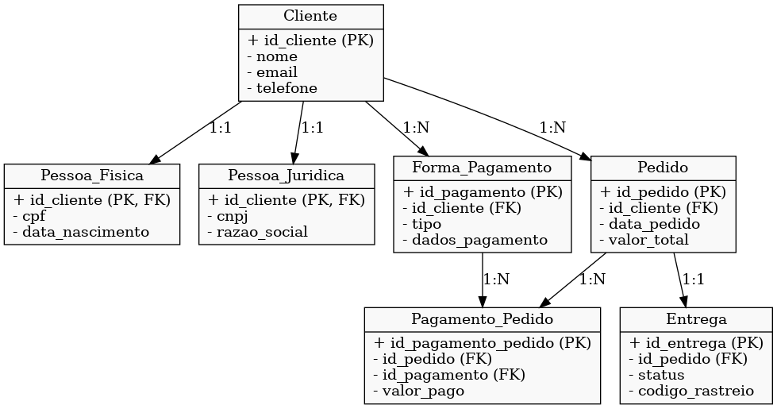

# 📦 Modelo Conceitual de E-commerce

## 📖 Descrição
Este projeto faz parte de um **desafio de modelagem conceitual** de banco de dados para um sistema de **E-commerce**.  
O objetivo é representar as principais entidades e relacionamentos envolvidos no processo de **clientes, pedidos, pagamentos e entregas**.

---

## 🎯 Objetivos do Desafio
Refinar o modelo conceitual apresentado, acrescentando os seguintes pontos:
- **Cliente PF e PJ** → Uma conta pode ser **Pessoa Física (PF)** ou **Pessoa Jurídica (PJ)**, mas **não pode ter as duas informações ao mesmo tempo**.
- **Pagamento** → Um cliente pode cadastrar **mais de uma forma de pagamento**.
- **Entrega** → Associada a um pedido, com **status** e **código de rastreio**.

---

## 🛠️ Modelo Conceitual

Diagrama gerado com **Graphviz**:



---

## 📌 Entidades e Relacionamentos

### Cliente
- `id_cliente (PK)`
- `nome`
- `email`
- `telefone`

Relacionamentos:
- 1:1 com **Pessoa Física** ou **Pessoa Jurídica** (**exclusivo**: não pode ser ambos).
- 1:N com **Pedidos**.
- 1:N com **Formas de Pagamento**.

---

### Pessoa Física
- `id_cliente (PK, FK)`
- `cpf`
- `data_nascimento`

### Pessoa Jurídica
- `id_cliente (PK, FK)`
- `cnpj`
- `razao_social`

---

### Forma de Pagamento
- `id_pagamento (PK)`
- `id_cliente (FK)`
- `tipo`
- `dados_pagamento`

Relacionamentos:
- 1:N com **Pagamento_Pedido**.

---

### Pedido
- `id_pedido (PK)`
- `id_cliente (FK)`
- `data_pedido`
- `valor_total`

Relacionamentos:
- 1:N com **Pagamento_Pedido**.
- 1:1 com **Entrega**.

---

### Pagamento_Pedido
- `id_pagamento_pedido (PK)`
- `id_pedido (FK)`
- `id_pagamento (FK)`
- `valor_pago`

---

### Entrega
- `id_entrega (PK)`
- `id_pedido (FK)`
- `status`
- `codigo_rastreio`

---

## 🚀 Como Executar
Para gerar o diagrama localmente:
```bash
pip install graphviz
python modelo.py
